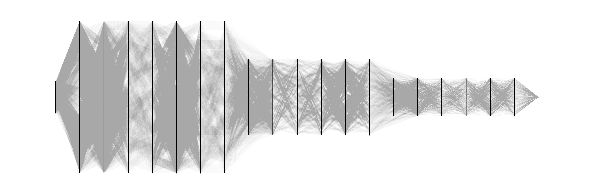

# Understanding Sparse Neural Networks from their Topology via Multipartite Graph Representations

Published in Transaction of Machine Learning (TMLR).

Official implementation of the paper "Understanding Sparse Neural Networks from their Topology via Multipartite Graph Representations", TMLR, April 2024.  


 [](https://openreview.net/forum?id=Egb0tUZnOY&referrer=%5BAuthor%20Console%5D(%2Fgroup%3Fid%3DTMLR%2FAuthors%23your-submissions))


**Authors**: [Elia Cunegatti](https://scholar.google.com/citations?hl=it&user=a2JJRjMAAAAJ),  [Matteo Farina](https://farinamatteo.github.io), [Doina Bucur](https://doina.net), [Giovanni Iacca](https://sites.google.com/site/giovanniiacca/).

<p align="center">
  
  <br>
  <em>Our proposed Multi-Partite Graph Represenation for Resnet-20 pruned with ERK at 98% sparsity.</em>
</p>

```bibtex
@article{
cunegatti2024understanding,
title={Understanding Sparse Neural Networks from their Topology via Multipartite Graph Representations},
author={Elia Cunegatti and Matteo Farina and Doina Bucur and Giovanni Iacca},
journal={Transactions on Machine Learning Research},
issn={2835-8856},
year={2024},
url={https://openreview.net/forum?id=Egb0tUZnOY}
}
```

## Setup
This project was developed with Python-3.9.18  You can find all dependencies in the `deps` folder, both as a standard list of pip requirements and as a conda environment. To create a conda environment for this project, run `conda env create -f environment.yaml`. To install dependencies using pip, run `pip install -r deps/requirements.txt`.
For downloading TinyImagenet dataset please run `sh tinyimagenet/load_tiny_imagenet.sh`.


## Usage

After installing all dependencies, you can start exploring the code. 
Given a combination of <model-pruning_algorithm-sparsity-dataset-seed>, generates the 
Sparse Neural Network (SNN), encodes it as a multipartite graph, and extracts all topometrics. 
Additionally, code also provides the option to extract the Ramanujan Properties of a given SNN.

To generate an SNN, its **multipartite graph representation**, and **topometrics**, run:
```
python main.py --encoding unrolled --graph_metrics topometrics
```
All the arguments option sare listed below:
```
  -h, --help            show this help message and exit
  --model {CONV-6,Resnet-20,Resnet-32,Wide-Resnet-28-2}
                        Model
  --dataset {CIFAR-10,CIFAR-100,tinyimagenet}
                        Dataset
  --sparsity SPARSITY   Sparsity
  --pruning {snip,synflow,grasp,prospr,uniform,er,erk}
                        Pruning Algorithm
  --seed SEED           Seed
  --encoding {rolled,rolled-channel,unrolled}
                        Graph Encoding
  --device {cuda,cpu}   Device
  --graph_metrics {topometrics,ramanunjan}
                        Graph Metrics
  --training TRAINING   Training
```

Select the combination <model-pruning_algorithm-sparsity-dataset-seed>, choose the graph encoding (**multipartite-unrolled**, *rolled*, or *rolled-channel*), and specify whether to extract the **topometrics** or *Ramanujan properties*.

## Paper's Results
All data used for the analyses presented in the paper is included. 
In the `graph_metrics` folder, you will find results for the topometrics tested in Section 4.2 for the three different graph encodings 
(Rolled BGE, Rolled-Channel BGE, and Unrolled MGE ours). Results for the Ramanujan Properties discussed in Section 4.1 can be found in `ramanunjan_results`. 
Additionally, `paper_results` includes data for Section 4.2's regression study (4.2.1), topometrics importance (4.2.2), and pruning algorithm ranking (4.2.3).

```
graph_data/
|   graph_metrics/
|   |   rolled/
|   |       # list of images
|   |   rolled_channel/
|   |       # list of images
|   |   unrolled/
|   |       # list of images
|
|   ramanunjan_results/
|   |   # models
|   paper_results/
|   |   # models
```

## Extra

For visualization purposes, we have included some graphical 
representations of our multipartite graph encoding for selected SNNs in the `figures` folder. 
Additionally, all 1,260 trained sparse models (4 architectures, 5 sparsity ratios, 7 pruning algorithms, 3 datasets, 
each trained under 3 different seeds) are available in a shared [Google Drive Folder](https://drive.google.com/drive/folders/1eR58v-wd1hK2gWxaGXQDreFHm7EbufdP?usp=share_link) in .pt format. 
The multipartite graph representation of each SNN is also stored in zstd format (see [here](https://github.com/facebook/zstd)).


## Contact
If you have any problem with the codebase please feel free to reach out at [elia.cunegatti@unitn.it](mailto:elia.cunegatti@unitn.it) or open a public issue 😀.
